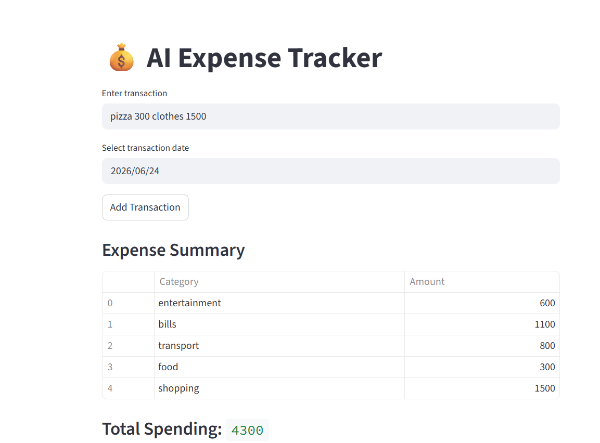
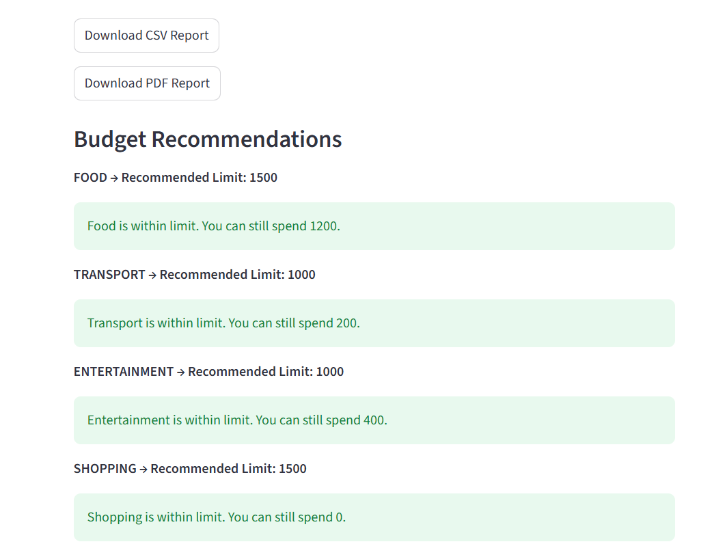
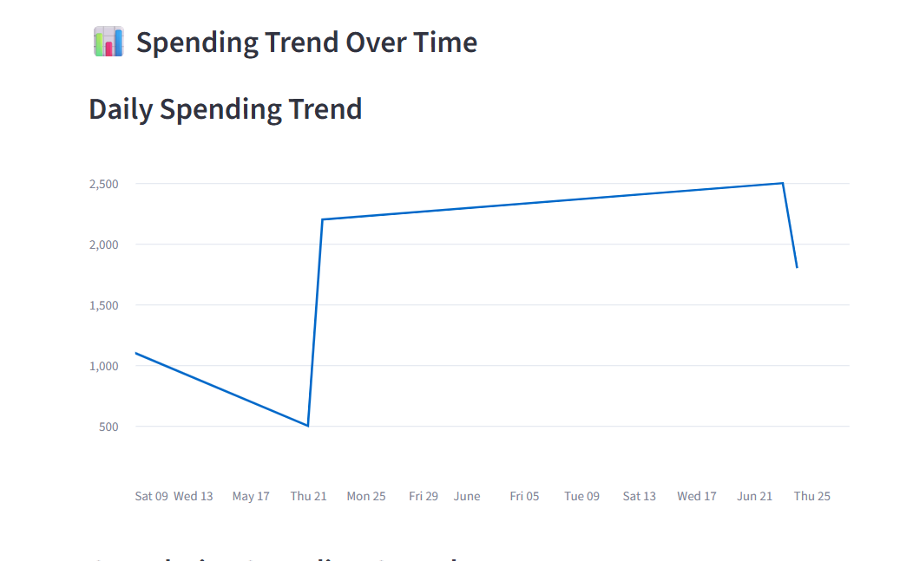

# AI Finance Tracker

# About
I built this project as part of my learning journey to explore how machine learning can be applied to personal finance. The idea was to create a simple application that helps users record their daily expenses, understand their spending habits, and get basic expense predictions using past transaction data.
This project gave me hands-on experience with Python, Streamlit, data preprocessing, and integrating a machine learning model into a working application.

# Features
* Record daily transactions
* View transaction history
* Analyze spending patterns
* Expense prediction using machine learning
* Interactive charts and visualizations
* Generate financial reports

# Technologies Used
* Python
* Streamlit
* Pandas
* NumPy
* Scikit-learn
* Matplotlib
* Joblib

# How to Run
1. Clone or download this repository.
2. Install the required libraries:
pip install -r requirements.txt
3. Run the application:
streamlit run app.py

# What I Learned
Building this project helped me understand how machine learning models can be integrated into a real application. I also improved my understanding of data handling, model integration, and creating interactive dashboards with Streamlit.

# Future Improvements
* Add user authentication
* Improve prediction accuracy
* Connect to a cloud database
* Add budget planning and reminders
# Screenshots
# Dashboard

# Category Prediction

# Pie Chart

# Budget Recommendation

# Daily Spending Trend

# Author
**Sakshi Yadav**
B.Tech CSE (3rd Year)
